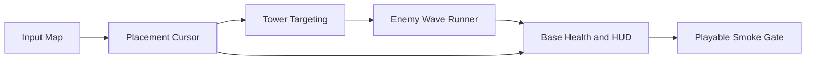

# Live Replay Smoke Design Plan

- Template: `tower_defense_2d`
- Template Label: Tower Defense Prototype
- Genre: `tower_defense_2d`
- Manifest: `data_tables/game_creation/game_creation_profile.json`

## Block Structure

## Modules

### Input Map

- Module ID: `input_map`
- Role: `developer`
- Scene: `project.godot`
- Script: `project.godot`
- Depends On: `-`
- Godot Nodes: `ProjectSettings`
- Skills: `manage_input_mapping, plan_game_feature`
- Constraints: scene resources must stay under scenes/ or project.godot; Godot node names referenced by scripts must exist in the generated scene; signals listed by the module must be declared or connected in generated GDScript; primary execution role is developer
- Response: Godot input actions expose cursor movement and tower placement controls.

### Placement Cursor

- Module ID: `placement_cursor`
- Role: `code_generator`
- Scene: `scenes/Player.tscn`
- Script: `scripts/player_controller.gd`
- Depends On: `input_map`
- Godot Nodes: `CharacterBody2D, CollisionShape2D`
- Skills: `generate_movement_script, attach_script_to_node, configure_physics_collision`
- Constraints: scene resources must stay under scenes/ or project.godot; Godot node names referenced by scripts must exist in the generated scene; signals listed by the module must be declared or connected in generated GDScript; primary execution role is code_generator; generated scripts must stay under scripts/ unless the module is project.godot
- Response: Cursor moves on the build grid and emits tower_placed on placement input.

### Tower Targeting

- Module ID: `tower_targeting`
- Role: `code_generator`
- Scene: `scenes/Tower.tscn`
- Script: `scripts/tower_controller.gd`
- Depends On: `placement_cursor`
- Godot Nodes: `Area2D, CollisionShape2D`
- Skills: `create_godot_scene, wire_signal_connection, attach_script_to_node`
- Constraints: scene resources must stay under scenes/ or project.godot; Godot node names referenced by scripts must exist in the generated scene; signals listed by the module must be declared or connected in generated GDScript; primary execution role is code_generator; generated scripts must stay under scripts/ unless the module is project.godot
- Response: Tower Area2D tracks enemies in range and emits fired when cooldown completes.

### Enemy Wave Runner

- Module ID: `enemy_wave`
- Role: `ai_controller`
- Scene: `scenes/Enemy.tscn`
- Script: `scripts/enemy_runner.gd`
- Depends On: `tower_targeting`
- Godot Nodes: `Area2D, CollisionShape2D`
- Skills: `generate_ai_behavior, configure_physics_collision, wire_signal_connection`
- Constraints: scene resources must stay under scenes/ or project.godot; Godot node names referenced by scripts must exist in the generated scene; signals listed by the module must be declared or connected in generated GDScript; primary execution role is ai_controller; generated scripts must stay under scripts/ unless the module is project.godot
- Response: Enemy moves toward the base and emits base_reached when crossing the goal line.

### Base Health and HUD

- Module ID: `base_hud`
- Role: `developer`
- Scene: `scenes/Main.tscn`
- Script: `scripts/hud_controller.gd`
- Depends On: `enemy_wave, placement_cursor`
- Godot Nodes: `CanvasLayer, Label, Node, Base`
- Skills: `auto_layout_ui, wire_signal_connection, manage_game_data_tables`
- Constraints: scene resources must stay under scenes/ or project.godot; Godot node names referenced by scripts must exist in the generated scene; signals listed by the module must be declared or connected in generated GDScript; primary execution role is developer; generated scripts must stay under scripts/ unless the module is project.godot; main-scene modules must wire child modules without duplicating gameplay state
- Response: HUD updates resources and base HP from placement and enemy reach events.

### Playable Smoke Gate

- Module ID: `playtest_gate`
- Role: `tester`
- Scene: `scenes/Main.tscn`
- Script: `-`
- Depends On: `base_hud`
- Godot Nodes: `Main, Player, Tower, Enemy, HUD`
- Skills: `smoke_test_scene, audit_logic_errors, audit_project_consistency`
- Constraints: scene resources must stay under scenes/ or project.godot; Godot node names referenced by scripts must exist in the generated scene; signals listed by the module must be declared or connected in generated GDScript; primary execution role is tester; main-scene modules must wire child modules without duplicating gameplay state
- Response: Scene smoke pass confirms placement input, tower targeting, enemy wave, HUD, and project resources.

## Skill Binding Plan

- `input_map` / `developer` -> `manage_input_mapping`: create stable Godot InputMap actions
- `input_map` / `developer` -> `plan_game_feature`: define feature contract and acceptance criteria
- `placement_cursor` / `code_generator` -> `generate_movement_script`: generate movement GDScript that consumes the input contract
- `placement_cursor` / `code_generator` -> `attach_script_to_node`: attach generated scripts to the declared scene nodes
- `placement_cursor` / `code_generator` -> `configure_physics_collision`: keep physics bodies and collision shapes aligned with gameplay
- `tower_targeting` / `code_generator` -> `create_godot_scene`: create a reusable Godot scene with required node hierarchy
- `tower_targeting` / `code_generator` -> `wire_signal_connection`: connect Godot signals to the owning controller
- `tower_targeting` / `code_generator` -> `attach_script_to_node`: attach generated scripts to the declared scene nodes
- `enemy_wave` / `ai_controller` -> `generate_ai_behavior`: generate deterministic enemy behavior for the template
- `enemy_wave` / `ai_controller` -> `configure_physics_collision`: keep physics bodies and collision shapes aligned with gameplay
- `enemy_wave` / `ai_controller` -> `wire_signal_connection`: connect Godot signals to the owning controller
- `base_hud` / `developer` -> `auto_layout_ui`: place HUD labels in a readable CanvasLayer layout
- `base_hud` / `developer` -> `wire_signal_connection`: connect Godot signals to the owning controller
- `base_hud` / `developer` -> `manage_game_data_tables`: persist balance values in a structured gameplay table
- `playtest_gate` / `tester` -> `smoke_test_scene`: validate the playable scene opens and responds
- `playtest_gate` / `tester` -> `audit_logic_errors`: catch missing signal, node, or script wiring
- `playtest_gate` / `tester` -> `audit_project_consistency`: check generated resources and manifest consistency

## Godot Response Map

- `move input` -> `Main/Player` -> `move placement cursor across the build grid`
- `place_tower input` -> `Main/Player` -> `emit tower_placed for build economy hooks`
- `tower cooldown` -> `Main/Tower` -> `emit fired when an enemy is in range`
- `enemy reaches base` -> `Main/Enemy` -> `damage base health and update HUD`
